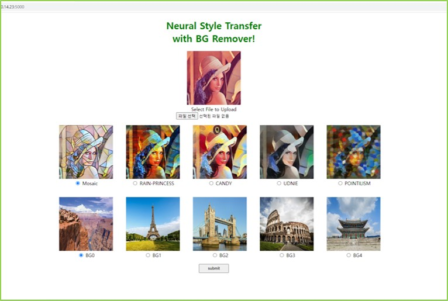
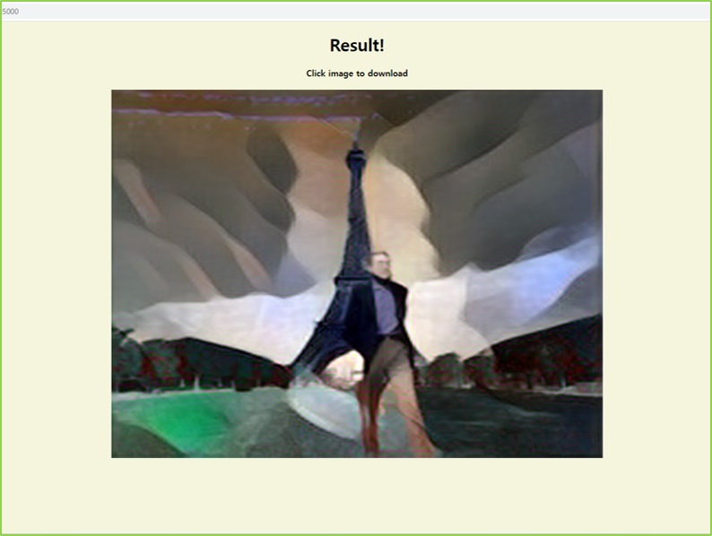
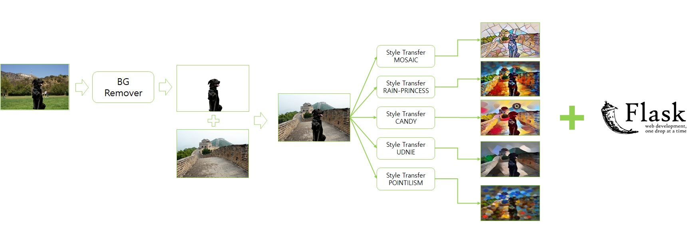
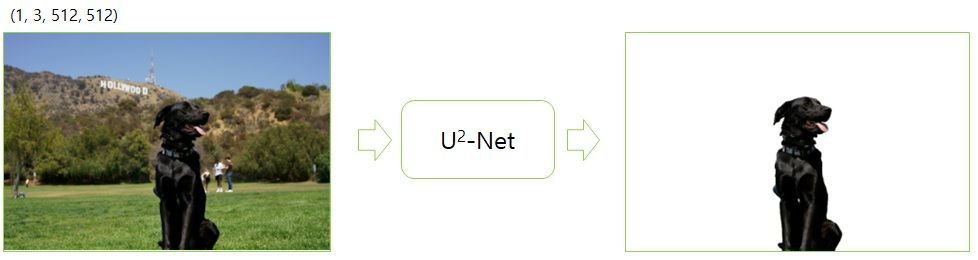
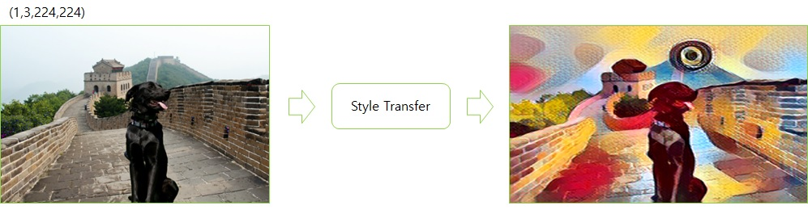
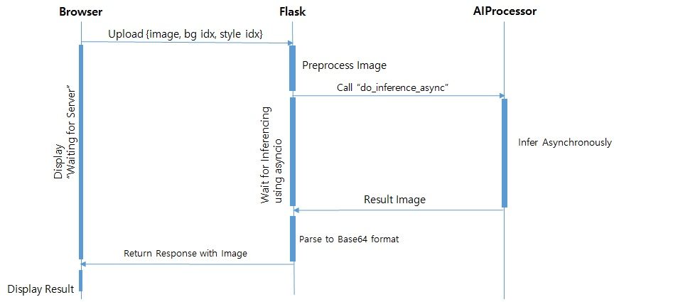
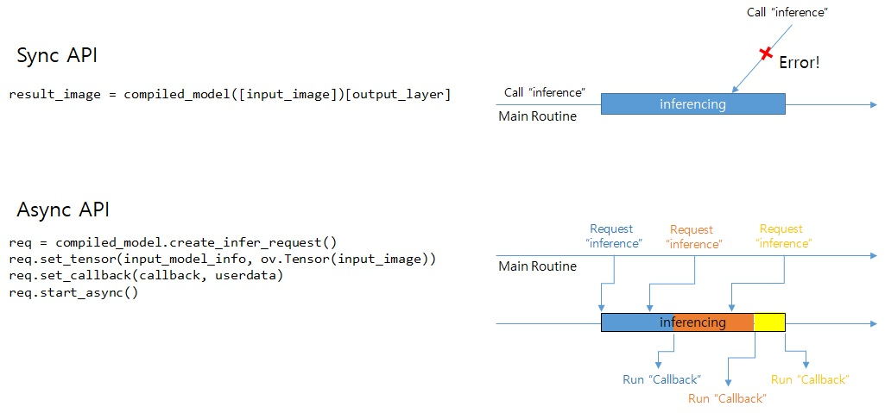
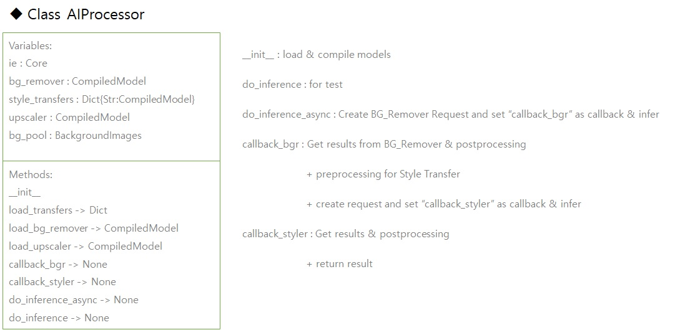
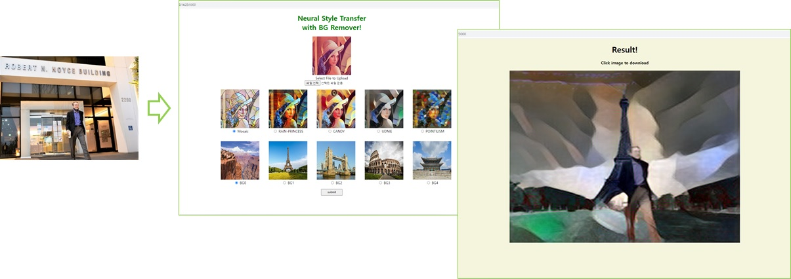

# OpenVINO_NeuralStyleTransferWithBGRemover
 OpenVINO_miniproject<br>
2023.07.05 ~ 2023.07.07<br>
Intel Edge AI SW Developer @ kccistc<br>
http://www.kccistc.net/

## Requirement

```
* 9th generation Intel® CoreTM processor onwards
* At least 32GB RAM
* Windows 10
* Python 3.9
```

## Clone code

```shell
git clone https://github.com/jangyj405/OpenVINO_NeuralStyleTransferWithBGRemover
```

## Prerequite

```shell
python -m venv .venv
.venv\Scripts\activate

cd OpenVINO_NeuralStyleTransferWithBGRemover
python -m pip install -U pip
python -m pip install -r requirements.txt
python model_downloaders.py
```

## Steps to run

```shell
.venv\bin\activate
cd OpenVINO_NeuralStyleTransferWithBGRemover
python flask_app.py
```
Open "http://127.0.0.1:5000" in your browser
## Output



Upload your image and click the "submit" button



# Appendix
## Concept


## BG Remover

OpenVINO Notebooks 205-vision-background-removal<br>
U2-Net : https://github.com/xuebinqin/U-2-Net

## Neural Style Transfer
OpenVINO Notebooks 404-style-transfer-webcam<br>
https://github.com/onnx/models/tree/main/vision/style_transfer/fast_neural_style


## Server


## OpenVINO Async API
OpenVINO Notebooks 115-async-api


## Class AIProcessor


## Conclusion
